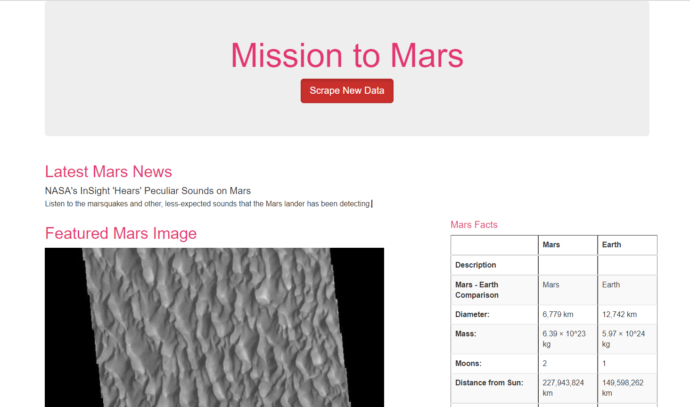
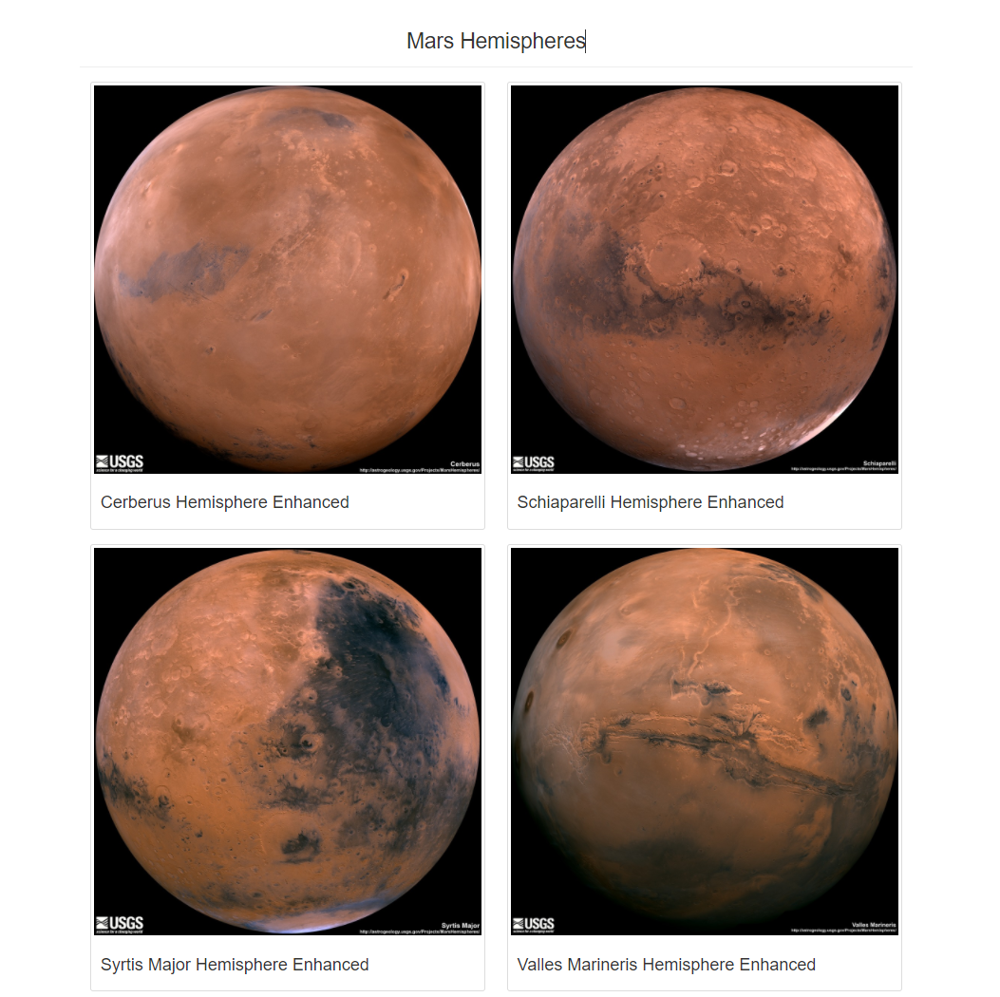

# Mission to Mars 
## Overview
Robin is a Junior Data Scientist who dreams of working for NASA one day.  She does free-lance astronomy work and is especially interested in the Mission to Mars.   She decided to write a script to pull all of the data she searches for into one location and show it to others and possibly get NASA's attention.
## Purpose
Robin has decided to use a specific method of gathering the latest data: web scraping. Using this technique, she has the ability to pull data from multiple websites, store it in a database, then present the collected data in a central location: a webpage.
## Resources
Software(s): Chrome Developer Tools, BeautifulSoup, Splinter, MongoDB v5.0.0, Flask, Bootstrap 3.3.3, Jupyter Notebook 6.4.0, Pandas, Python 3.7 and Visual Studio Code 1.57.1
## Summary
Multiple websites were scraped for data related to the Mission to Mars and displayed on a single HTML page for Robin to share. 
 

 
